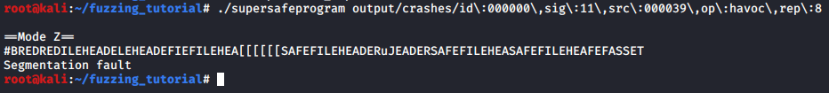

# Mutation Based Grey Box Fuzzing with AFL

*สามารถอ่านเวอร์ชั่นภาษาไทยได้ด้านล่าง*

## Preparations

For this tutorial, we are using [AFL (American Fuzzy Lop)](https://github.com/google/AFL) to perform the fuzzing. It could be cloned and install from the source repository using the following commands:

```sh
git clone https://github.com/google/AFL
cd AFL && make
export AFL_PATH=`pwd`
```

We have prepared a target program to do the fuzzing on. Go ahead and clone it also.

```sh
git clone https://github.com/Secure-D/fuzzing_tutorial.git
cd fuzzing_tutorial/
```

## Target Information

Our target program accepts an input file and reads the content line by line. There are some input verifications such that the first line must be **SAFEFILEHEADER** only, and the second line is the mode selection which can be either **A** or **Z**.

<p align="center">

</p>

In mode A, the program would print out the content of the file starting from line 3.

<p align="center">

</p>

And for mode Z, the program would use strcpy() to copy each line to another buffer variable sized 20 bytes, then reverse the text and print it out. If we edit the line 2 of *input/init_input* file from A to Z, the result would be as follows:

<p align="center">

</p>

Many may already know that strcpy() is a dangerous function and should not be used as it is vulnerable to buffer overflow, making mode z vulnerable.

However, it is very unlikely for a fuzzer to get into mode Z using a normal Black Box Fuzzing, as the input must have BOTH "SAFEFILEHEADER" on the first line and "Z" on the second line at the same time, so Grey Box Fuzzing become a better candidate for a task like this.

Let's try to make line 1 invalid.

<p align="center">

</p>

What about good line 1 and bad line 2?

<p align="center">

</p>

## Let's Fuzz!

Let's start by compiling the C source file using afl-gcc to do the instrumentation.

`afl-gcc supersafeprogram.c -o supersafeprogram`

<p align="center">

</p>

You can see that 36 locations in the code are now instrumented, allowing AFL to know which part of the code is running while fuzzing.

*NOTE: for those unable to use afl-gcc, we have prepared a precompiled instrumented binary for you, you can copy it out from the bin folder using `cp bin/supersafeprogram .`*

We can now start the fuzzing using afl-fuzz by using the file in *input/* as the initial input that would be mutated by the fuzzer, and we would store out outputs in *output/*.

`afl-fuzz -i input/ -o output/ -- ./supersafeprogram @@`

After running for a while, AFL would be able to find some inputs that make the program crash. We can now stop the fuzzer using Ctrl+C.

<p align="center">

</p>

The crash input files can be found at *output/crashes*, you can list them using ls.

`ls output/crashes/`

<p align="center">

</p>

To see the content of the file, use cat.

`cat output/crashes/<file_name>`

<p align="center">

</p>

AFL has successfully mutated our input file to go into mode Z, even if our original file has no sign pointing to mode Z at all.

We can replicate the crash by using the crash input as our new input.

`./supersafeprogram output/crashes/<file_name>`

<p align="center">

</p>

From this point on, we can use a debugger to analyze the crash and how could it be fixed/attacked.

As you can see, Grey Box Fuzzing is a very powerful method to help us automate the initial vulnerabilities finding process, making bug hunting faster and more efficient.

For more details on AFL, see [GitHub](https://github.com/google/AFL).

# Mutation Based Grey Box Fuzzing with AFL (TH)

## Preparations

ในตัวอย่างนี้ เราจะใช้ tool ที่ชื่อว่า [AFL (American Fuzzy Lop)](https://github.com/google/AFL) เพื่อทำการ fuzzing สามารถ clone มาจาก git แล้ว install บนเครื่องเราได้ด้วยคำสั่ง

```sh
git clone https://github.com/google/AFL
cd AFL && make
export AFL_PATH=`pwd`
```

เราได้เตรียมโปรแกรมเป้าหมายสำหรับทำการ fuzzing ไว้ให้ เริ่มต้นโดยการ clone ลงมาแล้วเข้าไปใน directory นั้นได้เลย

```sh
git clone https://github.com/Secure-D/fuzzing_tutorial.git
cd fuzzing_tutorial/
```

## Target Information

โปรแกรมตัวอย่างของเรา จะทำงานโดยการรับ file ที่เป็น input เข้ามา จากนั้นจะมีการอ่าน content ข้างในทีละบรรทัด โดยบรรทัดแรกต้องเป็นคำว่า **SAFEFILEHEADER** เท่านั้น ส่วนบรรทัดที่สอง เป็นการเลือก mode ในการทำงาน โดยต้องเป็นตัวอักษร **A** หรือ **Z** เท่านั้น

<p align="center">

</p>

โดยใน mode A จะทำการแสดง content ของแต่ละบรรทัดที่เหลือออกมา

<p align="center">

</p>

ส่วนใน mode Z จะทำการ copy ข้อความด้วยฟังก์ชัน strcpy() ไปยังตัวแปรที่กำหนดขนาดไว้ 20 bytes จากนั้นทำการกลับข้อความจากหน้าไปหลัง ก่อนที่จะแสดงข้อความออกมา เมื่อเราลองแก้ไฟล์ *input/init_input* ให้บรรทัดที่ 2 เป็น Z ดู จะได้ผลลัพธ์แบบนี้

<p align="center">

</p>

หลายคนอาจทราบดีว่าฟังก์ชัน strcpy() เป็นฟังก์ชันอันตรายที่สามารถทำให้เกิด buffer overflow ได้ง่าย ทำให้ mode Z เป็นจุดอันตรายในโปรแกรมนี้

ปัญหาคือ ด้วยการทำ Black Box Fuzzing ธรรมดา แทบจะเป็นไปไม่ได้เลยที่จะสุ่มให้ input บรรทัดแรกเป็นคำว่า SAFEFILEHEADER และบรรทัดที่สองเป็นตัวอักษร Z พร้อม ๆ กัน ทำให้ไม่สามารถ fuzzing ส่วนของ code ใน mode Z ได้ การทำ Grey Box Fuzzing เลยกลายมาเป็นตัวเลือกที่ดีสำหรับโปรแกรมแบบนี้

เมื่อแก้ input บรรทัดที่ 1 ให้ผิด

<p align="center">

</p>

เมื่อแก้ input บรรทัดที่ 2 ให้ผิด

<p align="center">

</p>

## Let's Fuzz!

เริ่มด้วยการ compile C source file ด้วย afl-gcc เพื่อทำ instrumentation

`afl-gcc supersafeprogram.c -o supersafeprogram`

<p align="center">

</p>

จะเห็นว่ามีการทำ instrument ไว้ทั้งหมด 36 ตำแหน่งใน code ของเรา เพื่อให้ตัว AFL สามารถรู้ได้ว่า code ส่วนไหนที่ทำงานบ้างในระหว่างการทำ fuzzing

*NOTE: ถ้าหากไม่สามารถใช้ afl-gcc ได้ เราได้เตรียม binary ที่มีการทำ instrumentation ไว้ให้แล้ว สามารถใช้คำสั้ง `cp bin/supersafeprogram .` เพื่อทำการ copy file ออกมาได้เลย*

เราสามารถเริ่มต้น fuzzing ด้วย afl-fuzz โดยใช้ไฟล์ใน *input/* เป็น input ต้นแบบที่จะถูกนำมา mutate และเก็บผลการ fuzzing ไว้ใน *output/*

`afl-fuzz -i input/ -o output/ -- ./supersafeprogram @@`

เมื่อปล่อยให้ AFL ทำงานไปเรื่อย ๆ จนเจอว่าพบการ crash ก็สามารถกด Ctrl+C เพื่อหยุดการทำงานได้

<p align="center">

</p>

ไฟล์ input ที่ทำให้โปรแกรมนั้น crash จะถูกเก็บไว้ใน *output/crashes* สามารถเข้าไปดูได้ด้วยคำสั่ง

`ls output/crashes/`

<p align="center">

</p>

จะพบไฟล์อยู่ สามารถอ่านไฟล์ได้ด้วยคำสั่ง

`cat output/crashes/<ชื่อไฟล์>`

<p align="center">

</p>

จะเห็นได้ว่าตัว AFL สามารถเจอว่าเมื่อกำหนดให้บรรทัดที่ 1 อยู่เหมือนเดิม แต่เปลี่ยนบรรทัดที่ 2 เป็น Z จะสามารถทำให้โปรแกรม crash ได้ ทั้งที่ input ต้นแบบของเราไม่มีการใช้ mode Z เลย

เมื่อลองรันไฟล์ของเรา ด้วย input ที่ afl สร้างขึ้นมา จะพบว่ามีการ crash เกิดขึ้นจริง

`./supersafeprogram output/crashes/<ชื่อไฟล์>`

<p align="center">

</p>

จากจุดนี้ เราสามารถใช้ debugger เพื่อวิเคราะห์การทำงานของโปรแกรมเพื่อวิเคราะห์ว่าช่องโหว่เกิดจากอะไร และอาจโดนโจมตีได้อย่างไรต่อไป

จะเห็นว่า การทำ Greybox Fuzzing นั้นจะช่วยให้สามารถ automate การหาช่องโหว่ได้ เป็นเทคนิคที่สามารถนำมาช่วยในการทำ bug hunting ได้อย่างมีประสิทธิภาพ 

สามารถดูรายละเอียดการใช้งาน AFL เพิ่มเติมได้ที่ [GitHub](https://github.com/google/AFL)