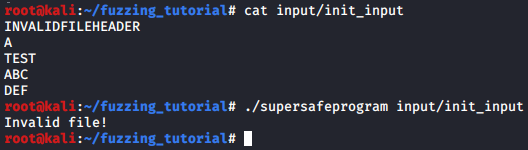

# Mutation Based Grey Box Fuzzing with AFL

## Preparations

ในตัวอย่างนี้ เราจะใช้ tool ที่ชื่อว่า [AFL (American Fuzzy Lop)](https://github.com/google/AFL) เพื่อทำการ fuzzing สามารถ clone มาจาก git แล้ว install บนเครื่องเราได้ด้วยคำสั่ง

```sh
git clone https://github.com/google/AFL
cd AFL && make
export AFL_PATH=`pwd`
```

เราได้เตรียมโปรแกรมเป้าหมายสำหรับทำการ fuzzing ไว้ให้ เริ่มต้นโดยการ clone ลงมาแล้วเข้าไปใน directory นั้นได้เลย

```sh
git clone https://github.com/Secure-D/fuzzing_tutorial.git
cd fuzzing_tutorial/
```

## Target Information

โปรแกรมตัวอย่างของเรา จะทำงานโดยการรับ file ที่เป็น input เข้ามา จากนั้นจะมีการอ่าน content ข้างในทีละบรรทัด โดยบรรทัดแรกต้องเป็นคำว่า **SAFEFILEHEADER** เท่านั้น ส่วนบรรทัดที่สอง เป็นการเลือก mode ในการทำงาน โดยต้องเป็นตัวอักษร **A** หรือ **Z** เท่านั้น

<div style="text-align:center"></div>

โดยใน mode A จะทำการแสดง content ของแต่ละบรรทัดที่เหลือออกมา

<div style="text-align:center"></div>

ส่วนใน mode Z จะทำการ copy ข้อความด้วยฟังก์ชัน strcpy() ไปยังตัวแปรที่กำหนดขนาดไว้ 20 bytes จากนั้นทำการกลับข้อความจากหน้าไปหลัง ก่อนที่จะแสดงข้อความออกมา เมื่อเราลองแก้ไฟล์ input/init_input ให้บรรทัดที่ 2 เป็น Z ดู จะได้ผลลัพธ์แบบนี้

<div style="text-align:center"></div>

หลายคนอาจทราบดีว่าฟังก์ชัน strcpy() เป็นฟังก์ชันอันตรายที่สามารถทำให้เกิด buffer overflow ได้ง่าย ทำให้ mode Z เป็นจุดอันตรายในโปรแกรมนี้

ปัญหาคือ ด้วยการทำ Black Box Fuzzing ธรรมดา แทบจะเป็นไปไม่ได้เลยที่จะสุ่มให้ input บรรทัดแรกเป็นคำว่า SAFEFILEHEADER และบรรทัดที่สองเป็นตัวอักษร Z พร้อม ๆ กัน ทำให้ไม่สามารถ fuzzing ส่วนของ code ใน mode Z ได้ การทำ Grey Box Fuzzing เลยกลายมาเป็นตัวเลือกที่ดีสำหรับโปรแกรมแบบนี้

เมื่อแก้ input บรรทัดที่ 1 ให้ผิด

<div style="text-align:center"></div>

เมื่อแก้ input บรรทัดที่ 2 ให้ผิด

<div style="text-align:center"></div>

## Let's Fuzz!

เริ่มด้วยการ compile C source file ด้วย afl-gcc เพื่อทำ instrumentation
`afl-gcc supersafeprogram.c -o supersafeprogram`

<div style="text-align:center"></div>

จะเห็นว่ามีการทำ instrument ไว้ทั้งหมด 36 ตำแหน่งใน code ของเรา เพื่อให้ตัว AFL สามารถรู้ได้ว่า code ส่วนไหนที่ทำงานบ้างในระหว่างการทำ fuzzing

*NOTE: ถ้าหากไม่สามารถใช้ afl-gcc ได้ เราได้เตรียม binary ที่มีการทำ instrumentation ไว้ให้แล้ว สามารถใช้คำสั้ง `cp bin/supersafeprogram .` เพื่อทำการ copy file ออกมาได้เลย*

เราสามารถเริ่มต้น fuzzing ด้วย afl-fuzz โดยใช้ไฟล์ใน *input/* เป็น input ต้นแบบที่จะถูกนำมา mutate และเก็บผลการ fuzzing ไว้ใน *output/*
`afl-fuzz -i input/ -o output/ -- ./supersafeprogram @@`

เมื่อปล่อยให้ AFL ทำงานไปเรื่อย ๆ จนเจอว่าพบการ crash ก็สามารถกด Ctrl+C เพื่อหยุดการทำงานได้

<div style="text-align:center"></div>

ไฟล์ input ที่ทำให้โปรแกรมนั้น crash จะถูกเก็บไว้ใน *output/crashes* สามารถเข้าไปดูได้ด้วยคำสั่ง
`ls output/crashes/`

<div style="text-align:center"></div>

จะพบไฟล์อยู่ สามารถอ่านไฟล์ได้ด้วยคำสั่ง
`cat output/crashes/<ชื่อไฟล์>`

<div style="text-align:center"></div>

จะเห็นได้ว่าตัว AFL สามารถเจอว่าเมื่อกำหนดให้บรรทัดที่ 1 อยู่เหมือนเดิม แต่เปลี่ยนบรรทัดที่ 2 เป็น Z จะสามารถทำให้โปรแกรม crash ได้ ทั้งที่ input ต้นแบบของเราไม่มีการใช้ mode Z เลย

เมื่อลองรันไฟล์ของเรา ด้วย input ที่ afl สร้างขึ้นมา จะพบว่ามีการ crash เกิดขึ้นจริง
`./supersafeprogram output/crashes/<ชื่อไฟล์>`

<div style="text-align:center"></div>

จากจุดนี้ เราสามารถใช้ debugger เพื่อวิเคราะห์การทำงานของโปรแกรมเพื่อวิเคราะห์ว่าช่องโหว่เกิดจากอะไร และอาจโดนโจมตีได้อย่างไรต่อไป

จะเห็นว่า การทำ Greybox Fuzzing นั้นจะช่วยให้สามารถ automate การหาช่องโหว่ได้ เป็นเทคนิคที่สามารถนำมาช่วยในการทำ bug hunting ได้อย่างมีประสิทธิภาพ 

สามารถดูรายละเอียดการใช้งาน AFL เพิ่มเติมได้ที่ [GitHub](https://github.com/google/AFL)
